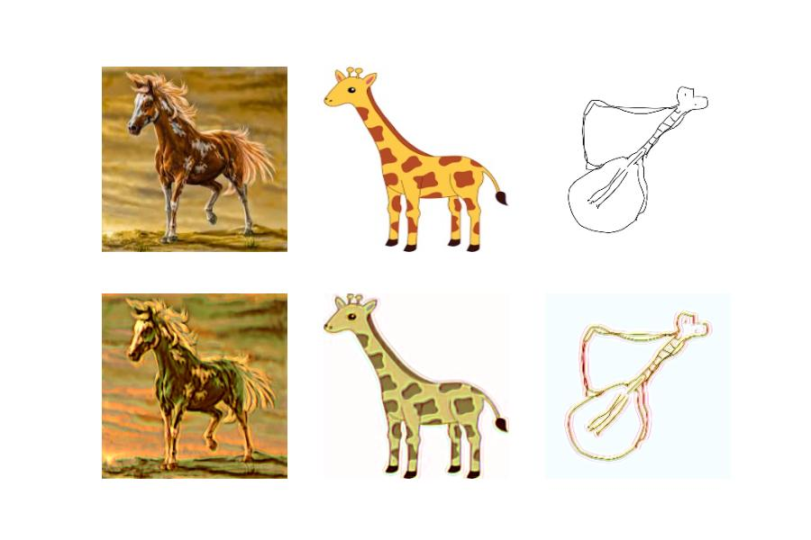
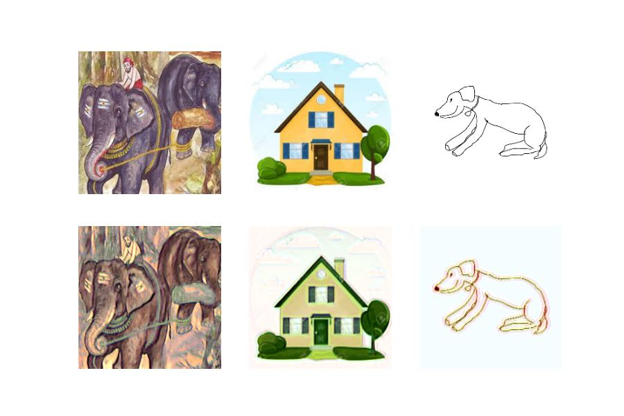

# Adversarial Teacher-Student Representation Learning for Domain Generalization

This is a PyTorch implementation of the paper **Adversarial Teacher-Student Representation Learning for Domain Generalization**

[Paper](https://proceedings.neurips.cc//paper/2021/file/a2137a2ae8e39b5002a3f8909ecb88fe-Paper.pdf) | [Supp](https://proceedings.neurips.cc/paper/2021/file/a2137a2ae8e39b5002a3f8909ecb88fe-Supplemental.pdf)

## Usage

### Setup
See the `requirements.txt` for environment configuration. 
```bash
pip install -r requirements.txt
```

### Datasets
- PACS: I prepared a version of the PACS dataset (ACS-P) [here](https://drive.google.com/file/d/1vsBPp057syGZ9ANGSBWucYSYllI9Eate/view?usp=sharing), where A, C, and S domains are used as the source domains and P is set as the target domain. You also can change to your own dataset, but keep the following structure: 
```bash
ACS-P/
├── ACS
│   ├── 1
│   │   ├── 0
│   │   ├── 1
│   │   ├── 2
│   │   ├── 3
│   │   ├── 4
│   │   ├── 5
│   │   └── 6
│   ├── 2
│   │   ├── 0
│   │   ├── 1
│   │   ├── 2
│   │   ├── 3
│   │   ├── 4
│   │   ├── 5
│   │   └── 6
│   └── 3
│       ├── 0
│       ├── 1
│       ├── 2
│       ├── 3
│       ├── 4
│       ├── 5
│       └── 6
└── P
    └── 0
        ├── 0
        ├── 1
        ├── 2
        ├── 3
        ├── 4
        ├── 5
        └── 6
```

### Training

#### Warmup Phase
```bash
cd warmup/main/
python train.py
```

#### Adversarial Teacher-Student Representation Learning
```bash
cd main/main/
python train.py
```

### Results
The reproduced result is a little bit lower than the reported result in the paper. Hope that someone could help me fill the gap. 
| Target |           ResNet-18 |                   |           ResNet-50 |                   |
|--------|--------------------:|------------------:|--------------------:|------------------:|
|        | Reproduced Accuracy | Reported Accuracy | Reproduced Accuracy | Reported Accuracy |
| Photo  |                94.4 |              97.3 |                97.8 |              98.9 |

You can use the file `samples.ipynb` to view images generated from the Augmentor. For examples: 

